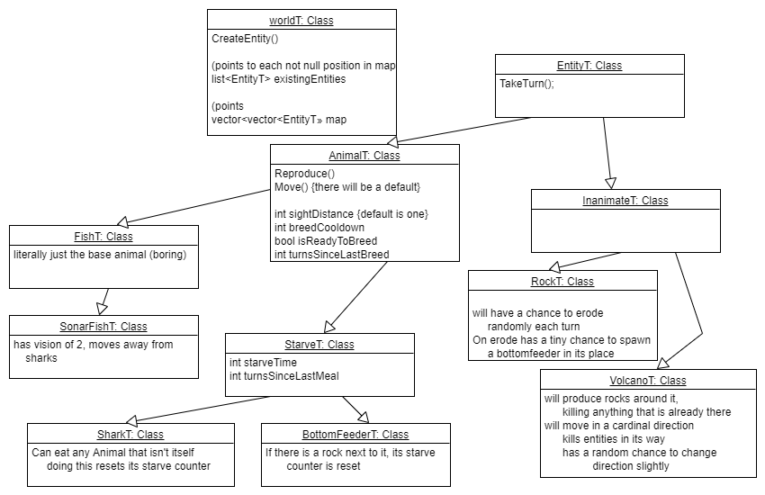

# Wa-Tor World
## Introduction

Hello and welcome to my Wa-Tor world!

For those who are unfamiliar with Wa-Tor:
[Wa-Tor is a population dynamics simulation invented, and then presented in 1984 by A.K. Dewdney.](https://en.wikipedia.org/wiki/Wa-Tor)

Wa-Tor is a 2d grid where "fish" and "sharks" live. Fish and sharks both reproduce, but sharks need to "eat" fish in order to... not starve. The base model is interesting to observe on its own.

For the [final project of my Fall 2021 Object Oriented Programming](http://mirkwood.cs.edinboro.edu/~bennett/class/csci330/fall2021/hw/five/index.html) class our professor had each of us develop a Wa-Tor world from scratch using the design principles and C++ tools that we had learned from the semester. In addition to the base model with fish and sharks, our professor wanted us to have 2 additional unique fish that did something different from the default sharks and fish.

I started this project with a rough design in [UXF](Design/Wator.uxf) of how I wanted my Wa-Tor world to work.  


While the finished product doesn't follow this exactly, this rough-draft helped me get started on the project.


## Overview

This project consists of four main class files and one initialization file. The code is fairly well commented, so feel free to peruse the files.

Entities [h](include/Entities.h), [cpp](src/Entities.cpp)- Makes up about 40% of the code, and includes the behavior of all the "entities". 

WorldT [h](include/WorldT.h), [cpp](src/WorldT.cpp)- The world is a 2d grid of smart pointers to the EntityT class. There's some logic going into how the world gets ticked and how the entities' turn order is chosen.

GodT [h](include/GodT.h), [cpp](src/GodT.cpp)- This class interacts with the "outside world". That means that it reads the initialization file and creates the Wa-Tor world according to those parameters.

Display [h](include/Display.h), [cpp](src/Display.cpp)- This is all the code relating to the conversion of the internal information into something you can see in the terminal. The program is designed such that a completely different display system could be used without needing to change anything except the display class.

[wator.init](wator.init) - this file is a series of integers which represent:
```
worldWidth worldHeight
fishNum fishBreed
sharkNum sharkStarve sharkBreed
bottomFeederNum bottomFeederStarve bottomFeederBreed
whaleNum whaleBreed whaleCannibal
rockNum rockErodeMin rockErodeMax
volcanoNum volcanoMoveFreq volcanoSpewFreq
volcanoSpewmagnitude volcanoSpewRange
volcanoDoomsdayDelay
```
These are all parameters which affect certain entities. Most of them are fairly self-explanatory. A full explanation of each parameter can be found [here](#initialization-parameters)

## Entities

### Fish
Reproduce asexually every *fishBreed* turns.
Moves to a random available tile in a cardinal direction.
	
### Sharks
Behave like fish, except that they will starve if they don't consume a fish atleast every *sharkStarve* turns. Prioritizes moving onto nearby fish in order to "eat" them. (cannot eat rocks, whales, and volcanoes)
	
### Bottom Feeders
Similarly to sharks, bottom feeders will starve to death if they dont get nutrients every *bottomFeederStarve* turns, but unlike sharks they get their nutrients by simply sitting next to rocks.
When they find a rock, they stay there, and send out babies every *bottomFeederBreed* turns from their position
	
### Whales
Whales are mostly indestructible. Volcanoes and rocks are the only things that can kill them. Whales move to a random tile in a cardinal direction irrespective of that tiles' current occupancy. If there happens to be an entity there then it gets swallowed by the whale and inserted into its stomach. If the whale moves onto a volcano or a rock, or a volcano spews a rock onto a whale, then the whale will spill the contents of its stomach onto the tiles nearby.


### Rocks
Have an increasing, random chance to erode when age is past *erodeMin* until it has a 100% chance to erode at *erodeMax*
	
### Volcanoes
Moves like a rook in chess, in any of the eight secondary intercardinal directions. Once it starts moving in a direction it keeps moving in that direction. A volcano has an increasing chance to move each turn until it moves. It also has an increasing chance to spawn rocks each turn until it does. Volcanoes can spawn rocks in different amounts, ranges, and frequencies around it, depending on the associated parameters in the init file. There is also a doomsday mechanic, where a volcano will fill most of the map with rocks after a *volcanoDoomsdayDelay* turns.

## WorldT

## GodT

## DisplayT


## Initialization Parameters
```
worldWidth worldHeight
fishNum fishBreed
sharkNum sharkStarve sharkBreed
bottomFeederNum bottomFeederStarve bottomFeederBreed
whaleNum whaleBreed whaleCannibal
rockNum rockErodeMin rockErodeMax
volcanoNum volcanoMoveFreq volcanoSpewFreq
volcanoSpewmagnitude volcanoSpewRange
volcanoDoomsdayDelay
```
- worldWidth: sets the world width. (can't be below 1)

- worldHeight: same as world width, but height

Fish Parameters:

- fishNum: sets the number of fish to spawn at the beginning

- fishBreed: sets the fish breed cooldown

Shark Parameters:

- sharkNum: sets the number of sharks to spawn at the beginning
- sharkStarve: sets the number of turns without food until a shark dies
- sharkBreed: sets the shark breed cooldown

Bottom Feeder Parameters:

- bottomFeederNum: sets the number of bottom feeders to spawn at the beginning
- bottomFeederStarve: sets the number of turns without food until a bottom feeder dies
- bottomFeederBreed: sets the bottom feeder breed cooldown

Whale Parameters

- whaleNum: sets the number of whales to spawn at the beginning
- whaleBreed: sets the whale breed cooldown
- whaleCannibal: If 1 then whales will be permitted to swallow each other 
(1 allows the possibility of whale-ception, which may eventually run your program out of memory if you let the whales swallow each other for long enough)
if it is anything but 1, then whales will be disallowed from swallowing each other

Rock Parameters:

- rockNum: sets the number of rocks to spawn at the beginning
- rockErodeMin: sets the minimum required age to erode
- rockErodeMax: sets the maximum age to erode (the chance increases as it ages)
				i.e: % chance of erode = 1/(erodeMax - (age - erodeMin))
				
Volcano Parameters:

- volcanoNum: sets the number of volcanos to spawn at the beginning
			(if doomsday is less than a very large number, multiple volcanos won't be too exciting)
- volcanoMoveFreq: sets how frequently a volcano will move (higher is less frequent)

- volcanoSpewFreq: sets how frequently a volcano will spew rocks (higher is less frequent)
- volcanoSpewmagnitude: sets how many rocks a volcano can spawn
- volcanoSpewRange: sets the taxicab range a volcano will spew rocks

- volcanoDoomsdayDelay: sets the delay on doomsday (filling most of the map with rocks)
